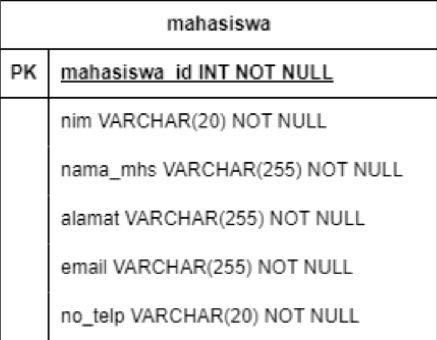
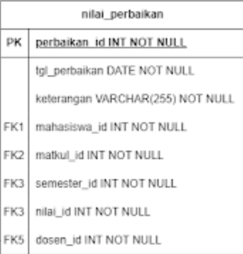
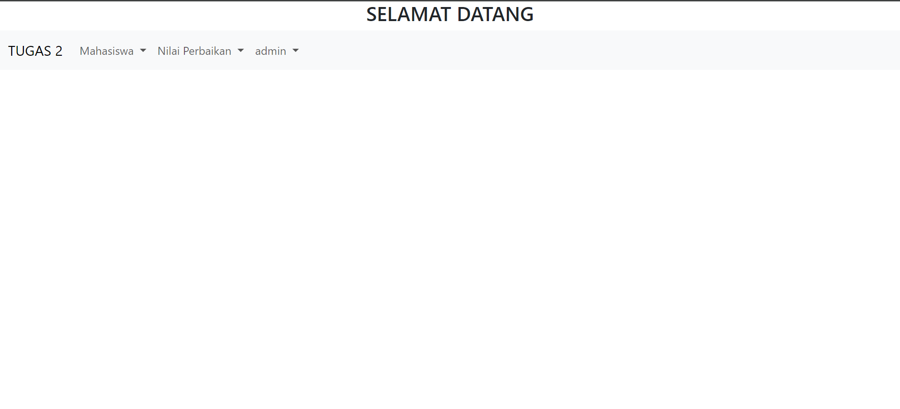
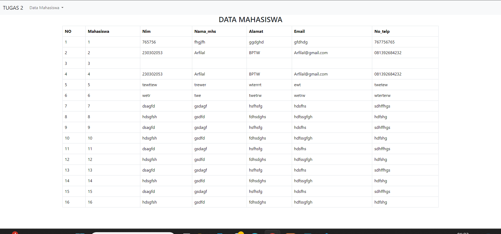
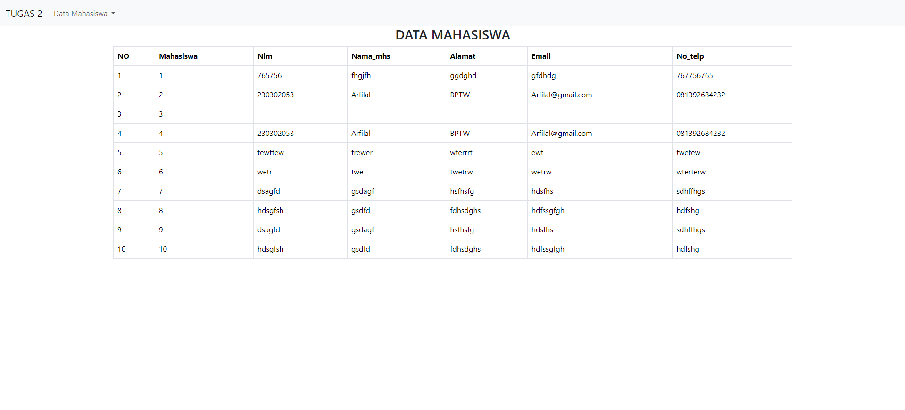
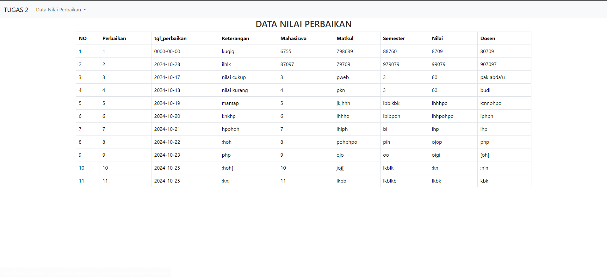
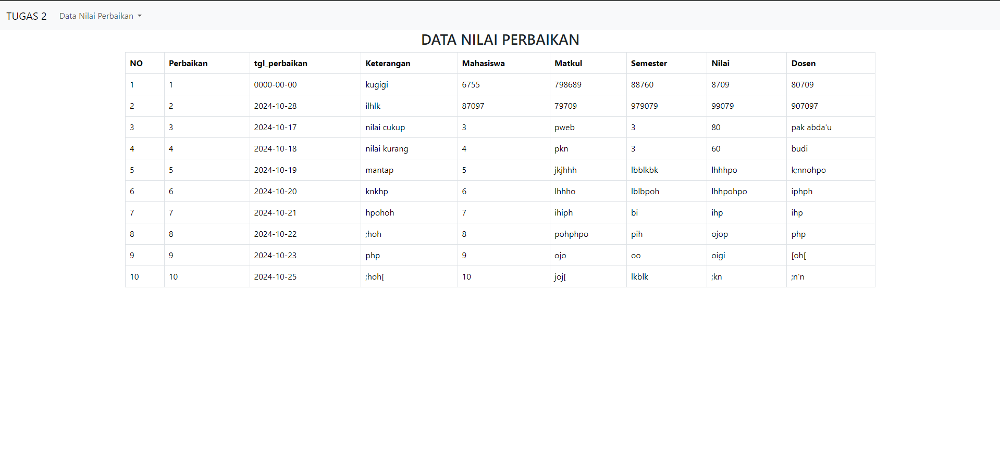

Nama : Arfilal Faiznadi

Kelas : TI 2C

NPM : 230302053

# PWEB 2 TUGAS 2

Studi Kasus


Mahaiswa dan Nilai Perbaikan

Task:
1. Create an OOP-based View, by retrieving data from the MySQL database
2. Use the _construct as a link to the database
3. Apply encapsulation according to the logic of the case study
4. Create a derived class using the concept of inheritance
5. Apply polymorphism for at least 2 roles according to the case study

Tables

1. mahasiswa



2. nilai perbaikan




# LANGKAH 1

membuat koneksi untuk menghubungkan database

## Kelas-kelas

### connection

Kelas ini menangani koneksi database.

```php
class connection {
    private $servername = "localhost";
    private $username = "root";
    private $password = "";
    private $dbname = "pwebtugas2";

    public function koneksi() {
        $db = new mysqli($this->servername, $this->username, $this->password, $this->dbname);
        return $db;
    }
}
```

### operasi

Kelas abstrak yang memperluas `connection` dan menyediakan metode untuk memilih semua catatan dari sebuah tabel.

```php
abstract class operasi extends connection {
    public function selectall($tabel) {
        $querry = "select * from $tabel";
        return parent::__construct()->querry($querry);
    }

    abstract function tblmahasiswa();
}
```

### dosen

Memperluas `operasi` untuk menampilkan data mahasiswa dalam format tabel.

### admin

Memperluas `operasi` untuk menampilkan data mahasiswa dengan kolom "Edit" tambahan.

## Pewarisan dan Polimorfisme

### Pewarisan (Inheritance)

1. Kelas `operasi` memperluas kelas `connection`:
   ```php
   abstract class operasi extends connection
   ```
   Ini memungkinkan `operasi` untuk mewarisi fungsionalitas koneksi database dari `connection`.

2. Kedua kelas `dosen` dan `admin` memperluas kelas `operasi`:
   ```php
   class dosen extends operasi
   class admin extends operasi
   ```
   Ini memungkinkan mereka untuk mewarisi metode dari `operasi`, seperti `selectall()`.

### Polimorfisme (Polymorphism)

1. Kelas `operasi` mendeklarasikan metode abstrak `tblmahasiswa()`:
   ```php
   abstract function tblmahasiswa();
   ```

2. Kedua kelas `dosen` dan `admin` mengimplementasikan versi mereka sendiri dari `tblmahasiswa()`:
   ```php
   class dosen extends operasi {
       public function tblmahasiswa() {
           // Implementasi untuk dosen
       }
   }

   class admin extends operasi {
       public function tblmahasiswa() {
           // Implementasi untuk admin
       }
   }
   ```
   Ini menunjukkan polimorfisme, karena nama metode yang sama digunakan tetapi dengan implementasi berbeda di setiap kelas turunan.

## Penggunaan

Untuk menggunakan skrip ini,biasanya akan:

1. Menyertakan file dalam skrip PHP.
2. Membuat instance dari kelas `dosen` atau `admin`.
3. Memanggil metode `tblmahasiswa()` untuk menampilkan data mahasiswa.

Contoh:
```php
include 'koneksi.php';

$dosen = new dosen();
$dosen->tblmahasiswa();

// Atau untuk tampilan admin
$admin = new admin();
$admin->tblmahasiswa();
```

## Konfigurasi Database

Koneksi database dikonfigurasi dalam kelas `connection`. Ubah properti berikut agar sesuai dengan pengaturan database:

```php
private $servername = "localhost";
private $username = "root";
private $password = "";
private $dbname = "pwebtugas2";
```

# 2. membuat tabel mahasiswa


# Dokumentasi Kode - Sistem Data Mahasiswa

Dokumentasi ini memberikan penjelasan rinci tentang implementasi kode dalam proyek Sistem Data Mahasiswa.


## koneksi.php

File ini menangani koneksi database dan mendefinisikan kelas-kelas untuk operasi database.

### Kelas `connection`

```php
class connection {
    private $servername = "localhost";
    private $username = "root";
    private $password = "";
    private $dbname = "pwebtugas2";

    public function koneksi() {
        $db = new mysqli($this->servername, $this->username, $this->password, $this->dbname);
        return $db;
    }
}
```

- **Tujuan**: Mengelola koneksi ke database MySQL.
- **Atribut**: Menyimpan kredensial database sebagai properti private.
- **Metode**: 
  - `koneksi()`: Mengembalikan objek koneksi mysqli.

### Kelas Abstrak `operasi`

```php
abstract class operasi extends connection {
    public function selectall($tabel) {
        $querry = "select * from $tabel";
        return parent::koneksi()->query($querry);
    }

    abstract function tblmahasiswa();
}
```

- **Tujuan**: Menyediakan operasi database umum dan template untuk kelas turunan.
- **Metode**: 
  - `selectall($tabel)`: Mengambil semua data dari tabel yang ditentukan.
  - `tblmahasiswa()`: Metode abstrak yang harus diimplementasikan oleh kelas turunan.

### Kelas `dosen`

```php
class dosen extends operasi {
    public function tblmahasiswa() {
        $data = parent::koneksi()->query("select * from mahasiswa");
        // ... (kode untuk menampilkan tabel HTML)
    }
}
```

- **Tujuan**: Menangani tampilan data mahasiswa untuk peran dosen.
- **Metode**: 
  - `tblmahasiswa()`: Mengambil dan menampilkan data mahasiswa dalam format tabel HTML.

### Kelas `admin`

```php
class admin extends operasi {
    public function tblmahasiswa() {
        $data = $this->selectall("mahasiswa");
        // ... (kode untuk menampilkan tabel HTML dengan opsi edit)
    }
}
```

- **Tujuan**: Menangani tampilan data mahasiswa untuk peran admin.
- **Metode**: 
  - `tblmahasiswa()`: Mengambil dan menampilkan data mahasiswa dengan opsi edit tambahan.

## index.php

File ini menangani tampilan utama dan logika untuk menampilkan data mahasiswa.

### Struktur HTML

```html
<!DOCTYPE html>
<html>
<head>
    <title>DATA MAHASISWA</title>
    <link href="https://cdn.jsdelivr.net/npm/bootstrap@5.3.3/dist/css/bootstrap.min.css" rel="stylesheet">
    <script src="https://cdn.jsdelivr.net/npm/bootstrap@5.3.3/dist/js/bootstrap.bundle.min.js"></script>
</head>
<body>
    <!-- Navbar -->
    <nav class="navbar navbar-expand-lg bg-body-tertiary">
        <!-- ... (kode navbar) ... -->
    </nav>

    <!-- Tabel Data Mahasiswa -->
    <h3 class="container text-center">DATA MAHASISWA</h3>
    <table class="m-auto table table-bordered w-75">
        <!-- ... (struktur tabel) ... -->
    </table>
</body>
</html>
```


### Logika PHP

```php
<?php 
include 'koneksi.php';
$no = 1;
$connection = new connection();

if(isset($_GET['role'])) {
    $role = $_GET['role'];
    if($role == "admin") {
        $query = "SELECT * FROM mahasiswa";
    } else if($role == "dosen") {
        $query = "SELECT * FROM mahasiswa LIMIT 10";
    } else {
        $query = "";
    }
} else {
    $query = "";
}

if(!empty($query)) {
    $data = $connection->koneksi()->query($query);
    foreach($data as $d) {
        // ... (kode untuk menampilkan baris data)
    }
} else {
    echo "<tr><td colspan='7'>Klik data Mahasiswa di navbar dan klik kembali untuk memulai</td></tr>";
}
?>
```

# 3.Membuat Tabel Nilai Pengganti

# Dokumentasi Kode - nilai_perbaikan.php

File `nilai_perbaikan.php` adalah bagian dari Sistem Data Mahasiswa yang menampilkan data nilai perbaikan mahasiswa. Berikut adalah dokumentasi komprehensif dari kode tersebut.

## Struktur File

File ini terdiri dari dua bagian utama:
1. Struktur HTML dengan Bootstrap untuk tampilan
2. Logika PHP untuk mengambil dan menampilkan data

## Komponen HTML

### Head Section
```html
<head>
    <title>DATA NILAI PERBAIKAN</title>
    <link href="https://cdn.jsdelivr.net/npm/bootstrap@5.3.3/dist/css/bootstrap.min.css" rel="stylesheet">
    <script src="https://cdn.jsdelivr.net/npm/bootstrap@5.3.3/dist/js/bootstrap.bundle.min.js"></script>
</head>
```
- Menggunakan Bootstrap 5.3.3 untuk styling
- Memasukkan CSS dan JavaScript Bootstrap

### Navbar
```html
<nav class="navbar navbar-expand-lg bg-body-tertiary">
  <!-- Navbar content -->
</nav>
```
- Implementasi navbar Bootstrap
- Termasuk dropdown menu untuk navigasi

### Tabel Data
```html
<h3 class="text-center">DATA NILAI PERBAIKAN</h3>
<table class="m-auto table table-bordered w-75">
  <!-- Table headers -->
</table>
```
- Menampilkan judul halaman
- Menggunakan tabel Bootstrap untuk menampilkan data

## Logika PHP

### Koneksi Database
```php
include 'koneksi.php';
$connection = new connection();
```
- Mengimpor file koneksi database
- Membuat instance dari kelas `connection`

### Pengecekan Role 
```php
if($_GET['role'] == "admin"){
    $query = "SELECT * FROM mahasiswa";
} else if($_GET['role']=="dosen"){
    $query = "select * from mahasiswa limit 10";
}
```
- Kode ini ada tetapi tidak digunakan dalam logika selanjutnya
- Dimaksudkan untuk membedakan query berdasarkan role, tapi tidak diimplementasikan

### Pengambilan Data
```php
$data = $connection->koneksi()->query("select * from nilai_perbaikan");
```
- Mengambil semua data dari tabel `nilai_perbaikan`
- Tidak menggunakan prepared statement (potensi risiko keamanan)

### Menampilkan Data
```php
foreach($data as $d){
    // Display data in table rows
}
```
- Iterasi melalui hasil query
- Menampilkan setiap baris data dalam tabel

# 4. Membuat codingan Tampilan

# Dokumentasi Kode - tampilan.php

File `tampilan.php` berfungsi sebagai halaman utama (landing page) untuk Sistem Data Mahasiswa. File ini menampilkan navbar dengan opsi navigasi yang berbeda berdasarkan peran pengguna (admin atau dosen).

## Struktur File

File ini terdiri dari dua bagian utama:
1. Logika PHP untuk mengelola peran pengguna
2. Struktur HTML dengan Bootstrap untuk tampilan

## Logika PHP

### Pengelolaan Peran Pengguna
```php
<?php
if(isset($_GET['role'])){
    $role = $_GET['role'];
    
    if($role == "admin"){
        $x="?role=admin";
    }else if($role == "dosen"){
        $x="?role=dosen";
    }
}
?>
```
- Memeriksa parameter 'role' dari URL
- Menetapkan variabel `$x` berdasarkan peran untuk digunakan dalam link navigasi
- Peran yang valid: 'admin' dan 'dosen'

## Komponen HTML

### Head Section
```html
<head>
    <meta charset="UTF-8">
    <meta name="viewport" content="width=device-width, initial-scale=1.0">
    <title>TUGAS 2</title>
    <link href="https://cdn.jsdelivr.net/npm/bootstrap@5.3.3/dist/css/bootstrap.min.css" rel="stylesheet">
    <script src="https://cdn.jsdelivr.net/npm/bootstrap@5.3.3/dist/js/bootstrap.bundle.min.js"></script>
</head>
```
- Menggunakan Bootstrap 5.3.3 untuk styling
- Memasukkan meta tags untuk responsivitas
- Memasukkan CSS dan JavaScript Bootstrap

### Body Content
```html
<body>
<h3 class="text-center">SELAMAT DATANG</h3>
<nav class="navbar navbar-expand-lg bg-body-tertiary">
  <!-- Navbar content -->
</nav>
</body>
```
- Menampilkan judul "SELAMAT DATANG"
- Implementasi navbar Bootstrap

### Navbar Structure
```html
<nav class="navbar navbar-expand-lg bg-body-tertiary">
  <div class="container-fluid">
    <a class="navbar-brand" href="#">TUGAS 2</a>
    <!-- Navbar toggle button for mobile -->
    <div class="collapse navbar-collapse" id="navbarSupportedContent">
      <ul class="navbar-nav me-auto mb-2 mb-lg-0">
        <!-- Dropdown menus -->
      </ul>
    </div>
  </div>
</nav>
```
- Navbar responsif dengan toggle button untuk tampilan mobile
- Berisi tiga dropdown menu: Mahasiswa, Nilai Perbaikan, dan Peran Pengguna

### Dropdown Menus
1. Mahasiswa
   ```html
   <li class="nav-item dropdown">
     <a class="nav-link dropdown-toggle" href="#" role="button" data-bs-toggle="dropdown" aria-expanded="false">
       Mahasiswa
     </a>
     <ul class="dropdown-menu">
       <li><a class="dropdown-item" href="index.php<?=$x ?>">Data MAHASISWA</a></li>
       <li><hr class="dropdown-divider"></li>
     </ul>
   </li>
   ```
   - Link ke halaman data mahasiswa dengan parameter peran

2. Nilai Perbaikan
   ```html
   <li class="nav-item dropdown">
     <a class="nav-link dropdown-toggle" href="#" role="button" data-bs-toggle="dropdown" aria-expanded="false">
       Nilai Perbaikan
     </a>
     <ul class="dropdown-menu">
       <li><a class="dropdown-item" href="nilai_perbaikan.php<?=$x ?>">Data Nilai Perbaikan</a></li>
       <li><hr class="dropdown-divider"></li>
     </ul>
   </li>
   ```
   - Link ke halaman nilai perbaikan dengan parameter peran

3. Peran Pengguna
   ```html
   <li class="nav-item dropdown">
     <a class="nav-link dropdown-toggle" href="#" role="button" data-bs-toggle="dropdown" aria-expanded="false">
       <?php if(isset($role)){echo $role;}else{echo "kuasa";}?>
     </a>
     <ul class="dropdown-menu">
       <li><a class="dropdown-item" href="tampilan.php?role=admin">Administrator</a></li>
       <li><a class="dropdown-item" href="tampilan.php?role=dosen">Dosen</a></li>
       <li><hr class="dropdown-divider"></li>
     </ul>
   </li>
   ```
   - Menampilkan peran saat ini atau "kuasa" jika tidak ada peran yang dipilih
   - Opsi untuk memilih peran: Administrator atau Dosen


# Program Keseluruhan
 

 KONEKSI
 ```php
<?php

class connection{
private $servername = "localhost"; 
private $username = "root";         
private $password = "";             
private $dbname = "pwebtugas2";  

public function koneksi(){
    $db = new mysqli ($this->servername, $this->username, $this->password, $this->dbname);
    return $db;
}
}

abstract class operasi extends connection
{
    public function selectall($tabel)
    {
        $querry = "select * from $tabel";
        return parent ::__construct()->querry($querry);
    }

    abstract function tblmahasiswa();
}

class dosen extends operasi
{
    public function tblmahasiswa()
    {
        $data = parent::__construct()->querry("select * from mahasiswa");
        ?>
     <tr>
                <th>NIM</th> 
                <th>Nama</th> 
                <th>Alamat</th> 
                <th>Email</th> 
                <th>No.Telp</th> 
    </tr>    
    <?php
    foreach ($data as $i){
        ?>
        <tr>
        <td><?= $i['nim']?></td>
        <td><?= $i['nama_mhs']?></td>
        <td><?= $i['alamat']?></td>
        <td><?= $i['email']?></td>
        <td><?= $i['no_telp']?></td>
            
        </tr>    
    <?php
    }  
    }
}
class admin extends operasi
{
    public function tblmahasiswa()
    {
        $data = $this->selectall("mahasiswa");
        ?>
        <tr>
                <th>NIM</th> 
                <th>Nama</th> 
                <th>Alamat</th> 
                <th>Email</th> 
                <th>No.Telp</th> 
                <th>Edit</th> 
    </tr>    
    <?php
    foreach ($data as $i){
        ?>
         <tr>
        <td><?= $i['nim']?></td>
        <td><?= $i['nama_mhs']?></td>
        <td><?= $i['alamat']?></td>
        <td><?= $i['email']?></td>
        <td><?= $i['no_telp']?></td>
            
        </tr>    
    <?php
    }
    }
}
?>

```

MAHASISWA
```php
<!DOCTYPE html>
<html>
<head>
    <title>DATA MAHASISWA</title>
    <link href="https://cdn.jsdelivr.net/npm/bootstrap@5.3.3/dist/css/bootstrap.min.css" rel="stylesheet" integrity="sha384-QWTKZyjpPEjISv5WaRU9OFeRpok6YctnYmDr5pNlyT2bRjXh0JMhjY6hW+ALEwIH" crossorigin="anonymous">
    <script src="https://cdn.jsdelivr.net/npm/bootstrap@5.3.3/dist/js/bootstrap.bundle.min.js" integrity="sha384-YvpcrYf0tY3lHB60NNkmXc5s9fDVZLESaAA55NDzOxhy9GkcIdslK1eN7N6jIeHz" crossorigin="anonymous"></script>
</head>
<body>
<nav class="navbar navbar-expand-lg bg-body-tertiary">
  <div class="container-fluid">
    <a class="navbar-brand" href="#">TUGAS 2</a>
    <button class="navbar-toggler" type="button" data-bs-toggle="collapse" data-bs-target="#navbarSupportedContent" aria-controls="navbarSupportedContent" aria-expanded="false" aria-label="Toggle navigation">
      <span class="navbar-toggler-icon"></span>
    </button>
    <div class="collapse navbar-collapse" id="navbarSupportedContent">
      <ul class="navbar-nav me-auto mb-2 mb-lg-0">
        <li class="nav-item dropdown">
          <a class="nav-link dropdown-toggle" href="#" role="button" data-bs-toggle="dropdown" aria-expanded="false">
            Data Mahasiswa 
          </a>
          <ul class="dropdown-menu">
            <li><a class="dropdown-item" href="tampilan.php">Kembali</a></li>
            <li><hr class="dropdown-divider"></li>
          </ul>
        </li>
      </ul>
    </div>
  </div>
</nav>

<h3 class="container text-center">DATA MAHASISWA</h3>
<table class="m-auto table table-bordered w-75">
    <tr>
        <th>NO</th>
        <th>Mahasiswa</th>
        <th>Nim</th>
        <th>Nama_mhs</th>
        <th>Alamat</th>
        <th>Email</th>
        <th>No_telp</th>
    </tr>
    <?php 
    include 'koneksi.php';
    $no = 1;
    $connection = new connection();

    if(isset($_GET['role'])) {
        $role = $_GET['role'];

        if($role == "admin") {
            $query = "SELECT * FROM mahasiswa";
        } else if($role == "dosen") {
            $query = "SELECT * FROM mahasiswa LIMIT 10";
        } else {
            $query = "";
        }
    } else {
        $query = "";
    }

    if(!empty($query)) {
        $data = $connection->koneksi()->query($query);
        foreach($data as $d) {
            ?>
            <tr>
                <td><?php echo $no++; ?></td>
                <td><?php echo $d['mahasiswa']; ?></td>
                <td><?php echo $d['nim']; ?></td>
                <td><?php echo $d['nama_mhs']; ?></td>
                <td><?php echo $d['alamat']; ?></td>
                <td><?php echo $d['email']; ?></td>
                <td><?php echo $d['no_telp']; ?></td>
            </tr>
            <?php 
        }
    } else {
        echo "<tr><td colspan='7'>Klik data Mahasiswa di navbar dan klik kembali untuk memulai</td></tr>";
    }
    ?>
</table>
</body>
</html>
```
NILAI PERBAIKAN

```php
<!DOCTYPE html>
<html>
<head>
	<title>DATA NILAI PERBAIKAN</title>
	<link href="https://cdn.jsdelivr.net/npm/bootstrap@5.3.3/dist/css/bootstrap.min.css" rel="stylesheet" integrity="sha384-QWTKZyjpPEjISv5WaRU9OFeRpok6YctnYmDr5pNlyT2bRjXh0JMhjY6hW+ALEwIH" crossorigin="anonymous">
    <script src="https://cdn.jsdelivr.net/npm/bootstrap@5.3.3/dist/js/bootstrap.bundle.min.js" integrity="sha384-YvpcrYf0tY3lHB60NNkmXc5s9fDVZLESaAA55NDzOxhy9GkcIdslK1eN7N6jIeHz" crossorigin="anonymous"></script>
</head>
<body>
<nav class="navbar navbar-expand-lg bg-body-tertiary">
  <div class="container-fluid">
    <a class="navbar-brand" href="#">TUGAS 2</a>
    <button class="navbar-toggler" type="button" data-bs-toggle="collapse" data-bs-target="#navbarSupportedContent" aria-controls="navbarSupportedContent" aria-expanded="false" aria-label="Toggle navigation">
      <span class="navbar-toggler-icon"></span>
    </button>
    <div class="collapse navbar-collapse" id="navbarSupportedContent">
      <ul class="navbar-nav me-auto mb-2 mb-lg-0">
        <li class="nav-item dropdown">
          <a class="nav-link dropdown-toggle" href="#" role="button" data-bs-toggle="dropdown" aria-expanded="false">
            Data Nilai Perbaikan
          </a>
          <ul class="dropdown-menu">
			<li><a class="dropdown-item" href="tampilan.php">Kembali</a></li>
            <li><hr class="dropdown-divider"></li>
          </ul>
        </li>
      </ul>
    </div>
  </div>
</nav>

	<h3 class= "text-center">DATA NILAI PERBAIKAN</h3>
	<table class="m-auto  table table-bordered w-75">
		<tr>
			<th>NO</th>
			<th>Perbaikan</th>
			<th>tgl_perbaikan</th>
			<th>Keterangan</th>
			<th>Mahasiswa</th>
			<th>Matkul</th>
			<th>Semester</th>
			<th>Nilai</th>
			<th>Dosen</th>
		</tr>
		<?php 
		include 'koneksi.php';
		if($_GET['role'] == "admin"){
			$query = "SELECT * FROM mahasiswa";
		}else if($_GET['role']=="dosen"){
			$query = "select * from mahasiswa limit 10";
		}
		$no = 1;
		$connection = new connection();
		$data = $connection->koneksi()->query("select * from nilai_perbaikan") ;
		foreach($data as $d){
			?>
			<tr>
				<td><?php echo $no++; ?></td>
				<td><?php echo $d['perbaikan']; ?></td>
				<td><?php echo $d['tgl_perbaikan']; ?></td>
				<td><?php echo $d['keterangan']; ?></td>
                <td><?php echo $d['mahasiswa_id']; ?></td>
				<td><?php echo $d['matkul']; ?></td>
				<td><?php echo $d['semester']; ?></td>
				<td><?php echo $d['nilai']; ?></td>
				<td><?php echo $d['dosen']; ?></td>
			</tr>
			<?php 
		}
		?>
	</table>
</body>
</html>
```
TAMPILAN
```PHP
<?php
if(isset($_GET['role'])){
    $role = $_GET['role'];
    
    if($role == "admin"){
        $x="?role=admin";
    }else if($role == "dosen"){
        $x="?role=dosen";
    }
}
?>

<!DOCTYPE html>
<html lang="en">
<head>
    <meta charset="UTF-8">
    <meta name="viewport" content="width=device-width, initial-scale=1.0">
    <title>TUGAS 2</title>
    <link href="https://cdn.jsdelivr.net/npm/bootstrap@5.3.3/dist/css/bootstrap.min.css" rel="stylesheet" integrity="sha384-QWTKZyjpPEjISv5WaRU9OFeRpok6YctnYmDr5pNlyT2bRjXh0JMhjY6hW+ALEwIH" crossorigin="anonymous">
    <script src="https://cdn.jsdelivr.net/npm/bootstrap@5.3.3/dist/js/bootstrap.bundle.min.js" integrity="sha384-YvpcrYf0tY3lHB60NNkmXc5s9fDVZLESaAA55NDzOxhy9GkcIdslK1eN7N6jIeHz" crossorigin="anonymous"></script>
</head>
<body>
<h3 class="text-center">SELAMAT DATANG</h3>
<nav class="navbar navbar-expand-lg bg-body-tertiary">
  <div class="container-fluid">
    <a class="navbar-brand" href="#">TUGAS 2</a>
    <button class="navbar-toggler" type="button" data-bs-toggle="collapse" data-bs-target="#navbarSupportedContent" aria-controls="navbarSupportedContent" aria-expanded="false" aria-label="Toggle navigation">
      <span class="navbar-toggler-icon"></span>
    </button>
    <div class="collapse navbar-collapse" id="navbarSupportedContent">
      <ul class="navbar-nav me-auto mb-2 mb-lg-0">
        <li class="nav-item dropdown">
          <a class="nav-link dropdown-toggle" href="#" role="button" data-bs-toggle="dropdown" aria-expanded="false">
            Mahasiswa
          </a>
          <ul class="dropdown-menu">
            <li><a class="dropdown-item" href="index.php<?=$x ?>">Data MAHASISWA</a></li>
            <li><hr class="dropdown-divider"></li>
          </ul>
        </li>
        <li class="nav-item dropdown">
          <a class="nav-link dropdown-toggle" href="#" role="button" data-bs-toggle="dropdown" aria-expanded="false">
            Nilai Perbaikan
          </a>
          <ul class="dropdown-menu">
            <li><a class="dropdown-item" href="nilai_perbaikan.php<?=$x ?>">Data Nilai Perbaikan</a></li>
            <li><hr class="dropdown-divider"></li>
          </ul>
        </li>
        <li class="nav-item dropdown">
          <a class="nav-link dropdown-toggle" href="#" role="button" data-bs-toggle="dropdown" aria-expanded="false">
            <?php if(isset($role)){echo $role;}else{echo "kuasa";}?>
          </a>
          <ul class="dropdown-menu">
            <li><a class="dropdown-item" href="tampilan.php?role=admin">Administrator</a></li>
            <li><a class="dropdown-item" href="tampilan.php?role=dosen">Dosen</a></li>
            <li><hr class="dropdown-divider"></li>
          </ul>
        </li>
      </ul>
    </div>
  </div>
</nav>
</body>
</html>
```
# DOKUMENTASI OUTPUT

TAMPILAN AWAL


TAMPILAN DATA MAHASISWA MODE ADMIN


TAMPILAN DATA MAHASISWA MODE DOSEN


TAMPILAN DATA NILAI PERBAIKAN MODE ADMIN


TAMPILAN DATA NILAI PERBAIKAN MODE ADMIN



